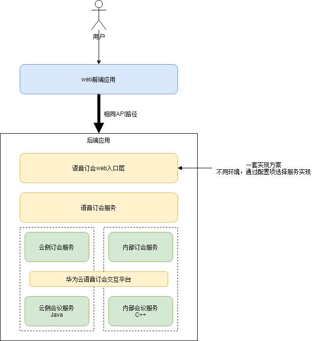

基于配置属性条件自动装配不同实现的服务组件
======
> IoC，控制反转容器，使用发布订阅模型，组件是主题，提供创造组件是生产者，引用注入组件是消费者。

这个想法可行，通过 @ConditionalOnProperty + @Service 实现。

spring-boot：@ConditionalOnProperty根据不同配置注入不同实现的bean
https://www.cnblogs.com/teach/p/15315046.html

SpringBoot 中@ConditionalOnProperty的妙用，指定接口实现
https://blog.csdn.net/qq_42651904/article/details/115012377

### reference
- [Condition Annotations](https://docs.spring.io/spring-boot/docs/current/reference/html/features.html#features.developing-auto-configuration.condition-annotations)
  - Class Conditions
  - Bean Conditions
  - Property Conditions
  - SpEL Expression Conditions

