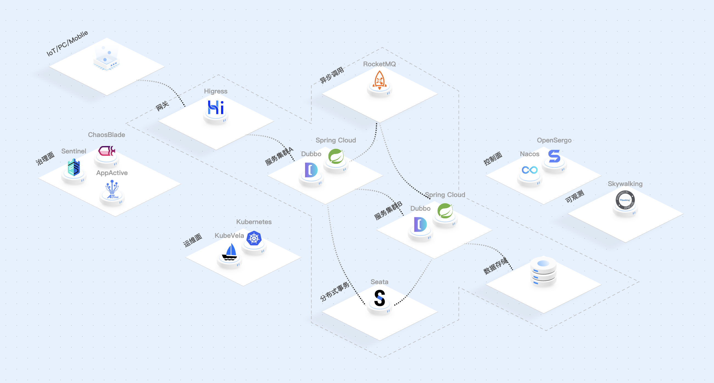

Nacos
======
> https://nacos.io/zh-cn/
> 
> GitHub https://github.com/alibaba/nacos
> 
> 手册/文档 https://nacos.io/zh-cn/docs/v2/what-is-nacos.html

一个更易于构建**云原生应用**的**动态服务发现、配置管理和服务管理平台**。

## 功能
### 动态配置服务
动态配置服务让您能够**以中心化、外部化和动态化的方式管理所有环境的配置**。动态配置消除了配置变更时重新部署应用和服务的需要。
**配置中心化管理**让实现**无状态服务**更简单，也让**按需弹性扩展服务**更容易。

### 服务发现及管理
动态服务发现对以**服务**为中心的（例如微服务和云原生）应用架构方式非常关键。Nacos支持DNS-Based和RPC-Based（Dubbo、gRPC）模式的服务发现。
Nacos也提供实时健康检查，以防止将请求发往不健康的主机或服务实例。借助Nacos，您可以更容易地为您的服务实现断路器。

### 动态DNS服务
通过支持**权重路由**，动态DNS服务能让您轻松实现**中间层负载均衡**、更灵活的**路由策略、流量控制**以及简单数据中心内网的简单DNS解析服务。
动态DNS服务还能让您更容易地实现以DNS协议为基础的服务发现，以消除耦合到厂商私有服务发现API上的风险。

## 微服务生态全景图

## 特性一览
### 易于使用
- **动态配置管理**、服务发现和动态的一站式解决方案
- 20多种**开箱即用**的以**服务**为中心的架构特性
- 基本符合生产要求的轻量级易用控制台

### 生产等级
- 脱胎于历经阿里巴巴10年生产验证的内部产品
- 支持具有数百万服务的大规模场景
- 具备企业级SLA的开源产品

### 更适应云架构
- 无缝支持Kubernetes和Spring Cloud
- 在主流公共云上更容易部署和运行（例如阿里云和AWS）
- **多租户**和**多环境**支持

### 丰富的应用场景
- 支持**限流、大促销预案和异地多活**
- 直接支持或稍作扩展即可支持大量有用的互联网应用场景
- **流量调度**和**服务治理**

## 谁在使用Nacos

## 愿景
Nacos 通过提供**简单易用的动态服务发现、服务配置、服务共享与管理等服务基础设施**，帮助用户在云原生时代，在私有云、混合云或者公有云等所有云环境中，
更好的构建、交付、管理自己的微服务平台，更快的复用和组合业务服务，更快的交付商业创新的价值，从而为用户赢得市场。

