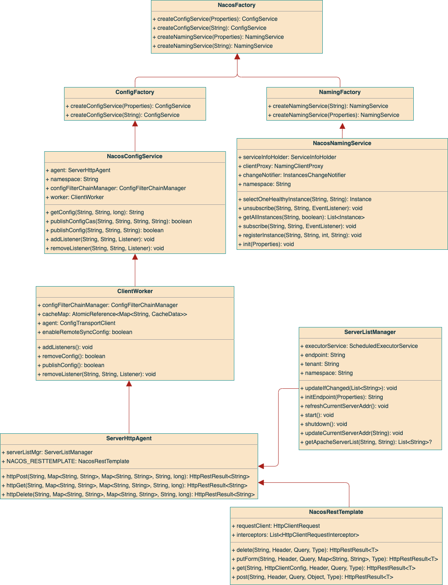

Nacos 架构
======
> https://nacos.io/zh-cn/docs/v2/architecture.html

## 基本架构及概念

### 服务 (Service)
**服务是指一个或一组软件功能**（例如特定信息的检索或一组操作的执行），其**目的是不同的客户端可以为不同的目的重用**（例如通过跨进程的网络调用）。
Nacos 支持主流的服务生态，如 Kubernetes Service、gRPC|Dubbo RPC Service 或者 Spring Cloud RESTful Service。

### 服务注册中心 (Service Registry)
服务注册中心，它是**服务，其实例及元数据的数据库**。服务实例在启动时注册到服务注册表，并在关闭时注销。
服务和路由器的客户端查询服务注册表以查找服务的可用实例。服务注册中心可能会调用服务实例的健康检查 API 来验证它是否能够处理请求。

### 服务元数据 (Service Metadata)
服务元数据是指包括**服务端点(endpoints)、服务标签、服务版本号、服务实例权重、路由规则、安全策略等描述服务的数据**。

### 服务提供方 (Service Provider)
是指**提供可复用和可调用服务的应用方**。

### 服务消费方 (Service Consumer)
是指**会发起对某个服务调用的应用方**。

### 配置 (Configuration)
在系统开发过程中通常会**将一些需要变更的参数、变量等从代码中分离出来独立管理，以独立的配置文件的形式存在**。
**目的**是让静态的系统工件或者交付物（如 WAR，JAR 包等）更好地**和实际的物理运行环境进行适配**。
**配置管理**一般包含在系统部署的过程中，由系统管理员或者运维人员完成这个步骤。**配置变更**是调整系统运行时的行为的有效手段之一。

### 配置管理 (Configuration Management)
在数据中心中，系统中**所有配置的编辑、存储、分发、变更管理、历史版本管理、变更审计等所有与配置相关的活动**统称为配置管理。

### 名字服务 (Naming Service)
提供分布式系统中**所有对象(Object)、实体(Entity)的“名字”到关联的元数据之间的映射管理服务**，
例如 ServiceName -> Endpoints Info, Distributed Lock Name -> Lock Owner/Status Info, DNS Domain Name -> IP List, 
**服务发现和 DNS** 就是名字服务的2大场景。

### 配置服务 (Configuration Service)
在服务或者应用运行过程中，提供**动态配置或者元数据以及配置管理的服务提供者**。

[更多概念...](https://nacos.io/zh-cn/docs/v2/concepts.html)

## 逻辑架构及其组件介绍

- 服务管理：实现**服务CRUD，域名CRUD，服务健康状态检查，服务权重管理**等功能
- 配置管理：实现**配置CRUD，版本管理，灰度管理，监听管理，推送轨迹，聚合数据**等功能
- 元数据管理：提供**元数据CURD 和打标能力**
- 插件机制：实现三个模块可分可合能力，实现扩展点SPI机制
- 事件机制：实现**异步化事件通知，sdk数据变化异步通知**等逻辑
- 日志模块：管理日志分类，日志级别，日志可移植性（尤其避免冲突），日志格式，异常码+帮助文档
- 回调机制：**sdk通知数据，通过统一的模式回调用户处理**。接口和数据结构需要具备可扩展性
- 寻址模式：解决**ip，域名，nameserver、广播等多种寻址模式**，需要可扩展
- 推送通道：解决**server与存储、server间、server与sdk间推送性能问题**
- 容量管理：**管理每个租户、分组下的容量**，防止存储被写爆，影响**服务可用性**
- 流量管理：按照**租户、分组**等多个维度**对请求频率，长链接个数，报文大小，请求流控进行控制**
- 缓存机制：**容灾目录，本地缓存，server缓存机制**。容灾目录使用需要工具
- 启动模式：按照单机模式，配置模式，服务模式，dns模式，或者all模式，启动不同的程序+UI
- 一致性协议：解决**不同数据，不同一致性要求**情况下，不同**一致性机制**
- 存储模块：解决**数据持久化、非持久化存储**，解决**数据分片问题**
- Nameserver：解决**namespace到clusterId的路由问题**，解决**用户环境与nacos物理环境映射问题**
- CMDB：解决**元数据存储**，与三方cmdb系统对接问题，解决**应用、人、资源关系**
- Metrics：暴露标准metrics数据，方便与三方监控系统打通
- Trace：暴露**标准trace**，方便**与SLA系统打通，日志白平化，推送轨迹**等能力，并且可以和**计量计费系统**打通
- 接入管理：相当于阿里云开通服务，**分配身份、容量、权限过程**
- 用户管理：解决**用户管理，登录，sso**等问题
- 权限管理：解决**身份识别，访问控制，角色管理**等问题
- 审计系统：扩展接口方便与不同**公司审计系统**打通
- 通知系统：**核心数据变更，或者操作**，方便通过SMS系统打通，**通知到对应人数据变更**
- OpenAPI：暴露标准Rest风格HTTP接口，简单易用，方便多语言集成
- Console：易用控制台，做服务管理、配置管理等操作
- SDK：多语言sdk
- Agent：dns-f类似模式，或者与mesh等方案集成
- CLI：命令行对产品进行轻量化管理，像git一样好用

## 领域模型
### 数据模型
**Nacos 数据模型 Key 由三元组唯一确定**, **Namespace**默认是空串，公共命名空间（public），**分组**默认是 DEFAULT_GROUP。

数据模型三元组：Namespace、Group、Service/DataId

### 服务领域模型

服务三元组：Namespace、Group、Service

### 配置领域模型
围绕配置，主要有两个关联的实体，一个是**配置变更历史**，一个是**服务标签**（用于**打标分类，方便索引**），由 ID 关联。

配置三元组：Namespace、Group、DataId

Config 配置信息表：id、namespace、group、dataId、content

History 配置变更历史表：id、nid、content、modifyUser、modifyTime、modifyIp

Tag 服务标签表：id、nid、tagName、tagType

## 类视图
### Nacos-SDK 类视图
服务部分待续

## 构建物、部署及启动模式

### 两种交付工件
Nacos 支持标准 Docker 镜像(TODO: 0.2版本开始支持）及 zip(tar.gz)压缩包的构建物。

### 两种启动模式
Nacos 支持将注册中心(Service Registry）与配置中心(Config Center) 在一个进程合并部署或者将2者分离部署的两种模式。

### 免费的公有云服务模式
除了您自己部署和启动 Nacos 服务之外，在云计算时代，Nacos 也支持公有云模式，在阿里云公有云的商业产品（如MSE, EDAS) 中会提供 Nacos 的免费的公有云服务。
我们也欢迎和支持其他的公有云提供商提供 Nacos 的公有云服务。

